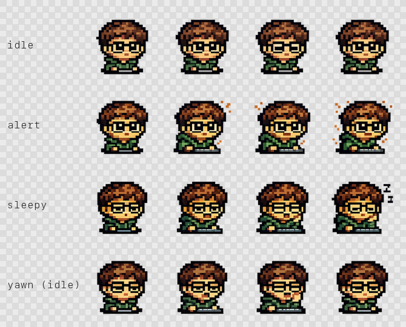

# NotchCritter

A tiny pixel creature that lives in your MacBook's notch, peeks out at your
cursor, and reacts to your typing rhythm.

Idle → dozes off. Typing picks up → perks up and the notch widens slightly
to give it room, Dynamic-Island-style. No settings screen, no accounts —
just a little companion living where the camera housing usually goes
unnoticed.

## Status

Core loop working: window positioning respects the real notch geometry,
the mood state machine reacts to typing, and the critter renders as an
animated SpriteKit sprite (idle/alert/sleepy) that wanders and yawns
when left idle. Multi-display support and a sleep-mode toggle are next
— see Roadmap.

## Requirements

- macOS 14+ (uses `NSScreen.safeAreaInsets` for notch detection)
- Xcode 15+ / Swift 5.9+
- Accessibility permission, for the keystroke-based mood reactions

## Getting started

```bash
git clone <your-fork-url>
cd NotchCritter
open Package.swift   # opens in Xcode via SwiftPM integration
```

Build and run from Xcode. On first launch, grant Accessibility access when
prompted (System Settings → Privacy & Security → Accessibility) so the
critter can react to typing.

## Project layout

```
Sources/NotchCritter/
  NotchCritterApp.swift      entry point (accessory app, no dock icon)
  AppDelegate.swift          wires up the overlay window + status item
  NotchWindowController.swift  borderless window pinned over the notch
  CritterState.swift         mood/expansion state machine
  CritterView.swift          SwiftUI host for the sprite + idle wandering
  CritterSpriteScene.swift   SpriteKit scene driving the frame animations
  KeystrokeMonitor.swift     CGEventTap-based typing activity signal
  Resources/Sprites/         idle/alert/sleepy/yawn frame sets
```

## Art

Pixel-art frames for each mood, bundled as SPM resources and loaded by
`CritterSpriteScene`:



## Roadmap

- [x] Replace the emoji placeholder with real sprite art / SpriteKit scene
- [ ] Smooth expand/collapse animation matching the real notch curvature
- [x] Idle behaviors (yawns, wandering) on a timer
- [ ] Respect multiple displays / notchless Macs gracefully
- [ ] Menu bar toggle for "sleep mode" during screen shares

## License

MIT — see [LICENSE](LICENSE).
